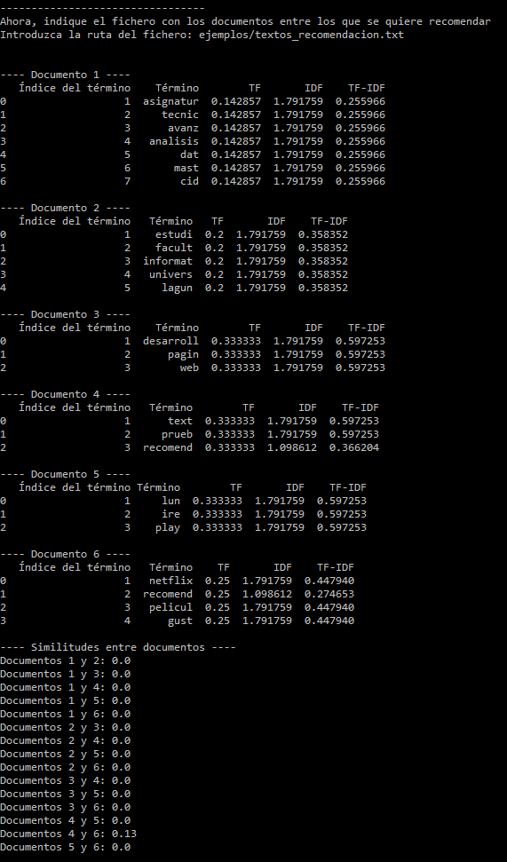

# Máster en Ciberseguridad e Inteligencia de Datos
## Técnicas Avanzadas de Análisis de Datos
### Proyecto de Sistemas Recomendadores
### David Valverde Gómez

#### Introducción 
El objetivo de este proyecto es construir un sistema recomendador basado en contenido, utilizando para ello los valores TF-IDF y la similitud del coseno entre documentos.

Para ello, se ha desarrollado un código python que pide al usuario un primer conjunto con los documentos que le gustan, y un segundo conjunto con el listado de documentos a recomendar. Entre ellos, el sistema recomendará los K documentos con mayor similitud a los que le gustan al usuario (siendo K indicado por él).

#### Código 
La carpeta ***src*** contiene dos archivos .py:
- **main.py**: Contiene el programa principal.
- **funciones.py**: Contiene las diversas funcionalidades implementadas.

Estas funciones, en orden de ejecución, son:
- **leer_fichero()**: Pide la ruta del fichero con los documentos y retorna un array de líneas con el contenido del archivo (cada línea representa un documento)
- **stemming_process(text)**: Recibe una cadena de texto y le realiza un proceso de limpieza que implica: convertir el texto a un vector de palabras, eliminar las tildes y signos de puntuación, convertir todas las palabras a minúsculas, eliminar las *stop words* y reducir las palabras a su raiz, utilizando la librería *SnowballStemmer*.
- **calculate_tfidf(docs)**: Recibe un array de documentos, donde cada documento se representa por su array de palabras después de haber pasado por el proceso de limpieza. Esta función calcula los valores TF, IDF y TF-IDF de cada palabra y construye la matriz con los valores TF-IDF de las palabras para cada documento, además de crear también, para cada documento, una matriz con los valores: Índice del término, Término, TF, IDF, TF-IDF .
- **similitud_coseno(df) / similitud_coseno_entre_matrices(df1, df2)**: Estas funciones llevan a cabo la misma función, con la diferencia de que la primera calcula la matriz de similitud del coseno entre los documentos de un único conjunto, mientras la segunda calcula la similitud entre los documentos de dos conjuntos distintos.
- **igualar_dimensiones_matrices(df1, df2)**: Para calcular la matriz de similitud del coseno entre dos conjuntos de documentos, ambos conjuntos deben tener las mismas dimensiones y las mismas palabras, es decir, las palabras que estén en el df1 deben aparecer en df2 aunque sea con valor 0.
- **seleccionar_recomendaciones(matriz, nrecomendaciones)**: Una vez calculada la matriz de similitud del coseno entre los dos conjuntos, esta función selecciona los N documentos del segundo conjunto con mayor similitud con algún documento del primer conjunto, es decir, selecciona las recomendaciones en base a su similitud con los documentos que le gustan al usuario.

#### Uso
En la carpeta ***ejemplos*** se encuentran 3 pares de conjuntos de documentos de ejemplo (textos_entrenamiento y textos_recomendacion).

Para ejecutar el programa simplemente se debe escribir el comando ***python src/main.py*** y se activará un texto donde el usuario debe introducir la ruta al fichero con los documentos que le gustan al usuario (textos_entrenamiento), tras esto, aparecerán los datos relativos a estos documentos y se pedirá la ruta del segundo conjunto (textos_recomendacion). Una vez aparezcan los datos de este segundo conjunto, se mostrará la similitud entre los documentos de ambos conjuntos y se pedirá al usuario que indique el número de documentos a recomendar. Finalmenta aparecerán los documentos recomendados.

